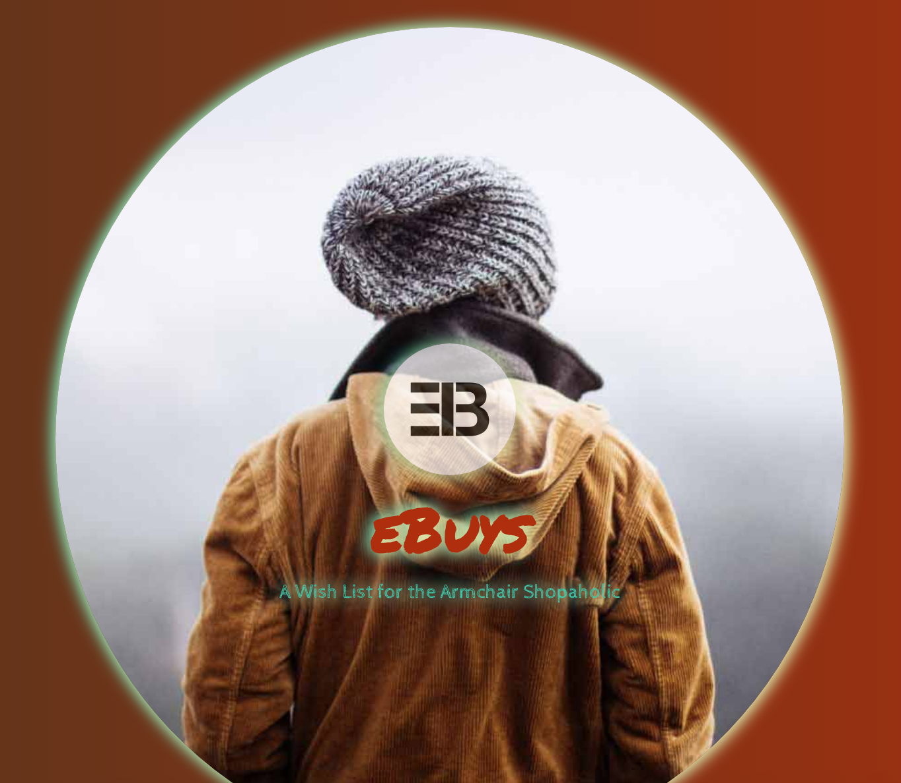
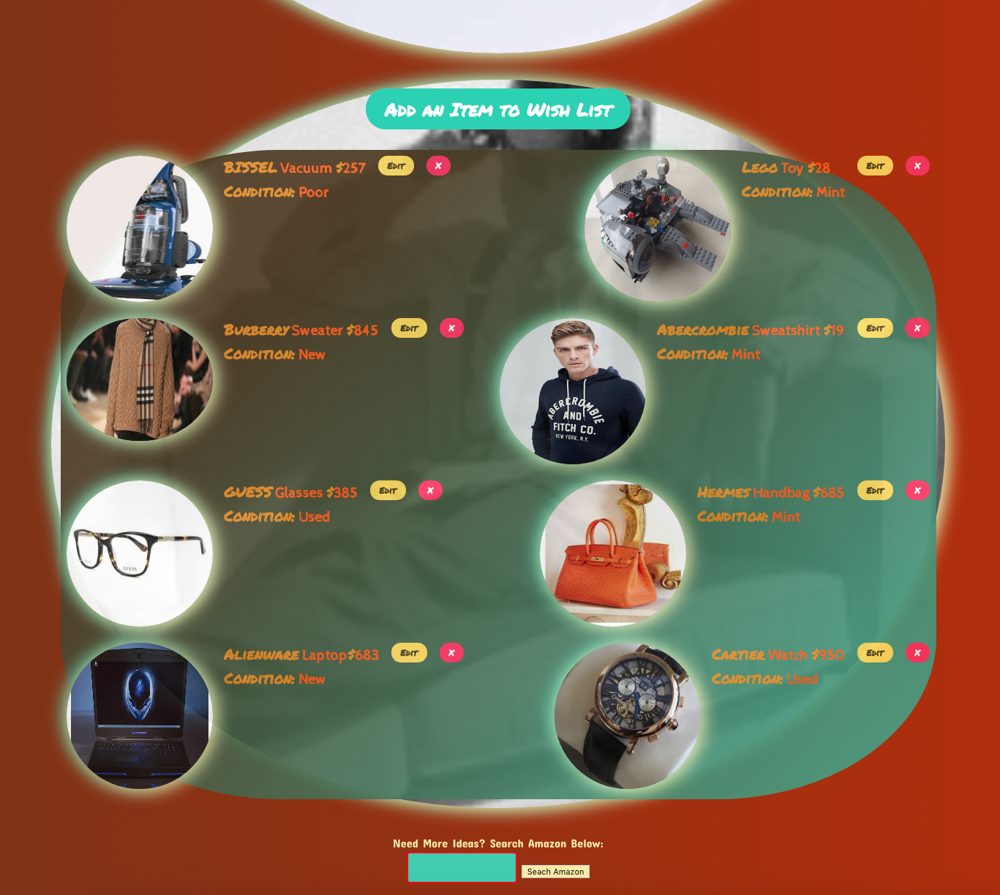

# [eBuys](https://ebuys.herokuapp.com/)

Author: [Amit Zaman](https://github.com/amitzed)

  

  

#### This App is a simple wish list for the person who enjoys doing their shopping online.  It was fun creating motion effects and utilizing other trends such as parallax.  

#### While the app currently has an Amazon.com search bar at the bottom to search for ideas, possible future functionality will include an image upload function (as opposed to an image link needing to be added to the form), a login function where different users can save their lists, or the app may be transformed to an eBay-esque site where sellers can post their items and others can add items to cart and then checkout by being directed to a purchase screen.
 
* Ruby version:
  2.5.0

The Following Technologies Were Used:

* Ruby on Rails

* React JS

* PostgreSQL

* Bulma Framework

### Deployment instructions:
 ##### rails s
 ##### postgres -D /usr/local/var/postgres
 ##### open : localhost:3000

To see the app's Heroku deployment, click the eBuys name above or go to:
https://ebuys.herokuapp.com/
